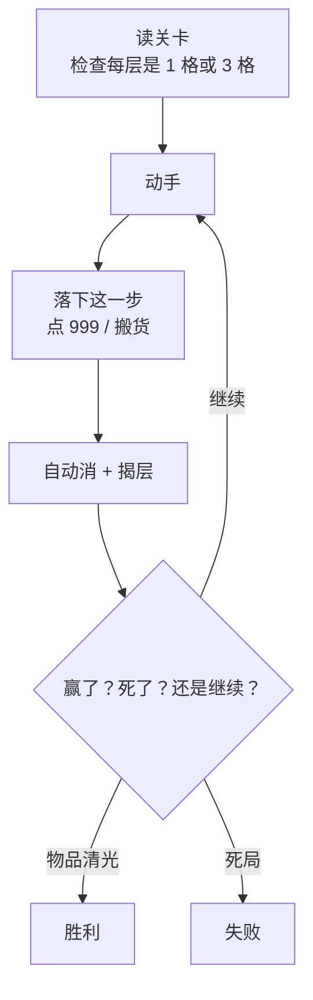
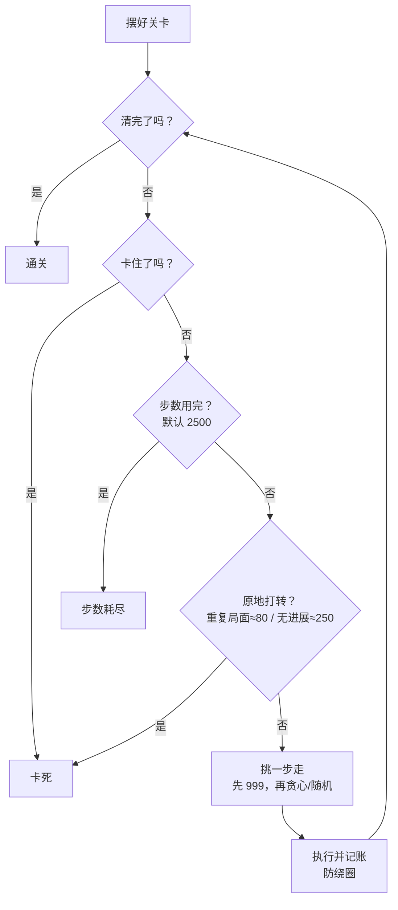

# 模拟规则说明（白话版）

本文说明「货架三消」怎么玩，以及难度模拟（电脑连打很多局）的流程、选步打分、关卡难度分怎么算。  
对应代码：`engine.js`（规则）、`analyze.js`（模拟与打分）。

> 难度模拟**不计时、不用道具**，只看「光靠搬货能不能清完」。

---

## 1. 这是在干啥

### 游戏一句话

只能动每排货架**最外面那一层**。把三个一样的货凑满一排**三格架**就消掉；消完或搬空后，底下会露出来。清光就赢；消不了又翻不出新层就死。

### 人玩 vs 电脑模拟

| 比什么 | 你自己玩 (`game.js`) | 电脑模拟难度 (`analyze.js`) |
|--------|----------------------|-----------------------------|
| 目标 | 在限时内清完所有货 | 估这关有多容易卡死 / 通关 |
| 时间压力 | 有（货越多时间越长，最少 60 秒） | 没有 |
| 道具 | 冻结 / 重排 / 锤子 | 不能用 |
| 谁决定下一步 | 你拖鼠标 | 贪心打分或随机 |
| 怎么算输 | 超时，或盘面死掉 | 盘面死掉，或绕圈 / 走太久 |

### 关卡长什么样

关卡是一堆货架，像叠盘子：最上面才能动手，底下被挡住。

- **三格架**：一层 3 格，可进可出；消除只能在这种架上（三格满且同色）。
- **单格架**：一层 1 格，**只出不进**，不能当落点。
- `0` = 空位；普通数字 = 货的种类；`999` = 点一下就消，不用凑三。

```js
[
  [[0,18,18],[38,33,0]], // 三格架，两层
  [[9],[18],[56]],       // 单格架，三层
]
```

### 模拟输出什么

同一关打很多遍（页面默认 **120** 局，单局最多约 **2500** 步），汇总：

通关率、卡死率、卡死时进度、半程前卡死率、通关步数分位、难度分 0–100 与档位。

---

## 2. 棋盘规则（人和电脑都一样）

### 主流程



### 搬货限制

| 情况 | 白话 |
|------|------|
| 只能动最外层 | 下面被挡住的不能直接点 |
| 从哪拿 | 最外层有货就能拿；999 是点掉，不是搬走 |
| 往哪放 | 只能放三格架空位；单格架不能接货 |
| 空货架 | 可以当新的空三格层来接货 |
| 同架内挪 | 人可以；电脑枚举动作时故意不算（对三消顺序不重要） |

### 怎么算消掉

**普通三消**：某三格架最外层三个格子都满、且编号相同 → 整层消失，可连锁。同色散在多排上，要先搬到同一排。

**999**：点一下就没，不参与三消。电脑有 999 时几乎总是优先点。

### 死局口诀

**还有货 + 眼前消不了 + 哪一层都搬不空 → 凉了。**

- **眼前还能消吗**：已有满三同色，或有 999，或最外层同色合计 ≥ 3（还能挪到一起）。
- **还能翻新层吗**：有没有一排，能把最外层货**全部**挪到别处空位上（空位够装）。能搬空就会露下一层。

人不玩时还有倒计时、冻结、重排、锤子——**模拟一律不用**。

---

## 3. 电脑怎么打一局

把它想成：同一个关卡让机器人连打很多局，每局一步步搬，直到通关、卡死、或走太久。



### 三种结局

| 结局 | 含义 |
|------|------|
| **通关** | 场上一个货都不剩 |
| **卡死** | 死局 / 无合法动作 / 同样局面绕太多次 / 很久没有任何清货进展 |
| **步数耗尽** | 还没通关也没判死，但走满上限（默认 2500） |

### 每步怎么挑（简版）

1. 有 999 → 优先点掉  
2. **贪心（默认）**：给候选步骤打分，挑高分；差不多则在前几名里随机  
3. **随机模式**：合法步里瞎抓（用来对照）  
4. 走完若局面以前见过 → 换一步；老撞旧局面算「绕圈」

### 常见旋钮

| 参数 | 默认 | 意思 |
|------|------|------|
| 模拟局数 | 页面 120 | 同一关连打多少遍 |
| 步数上限 | 2500 | 一局最多搬多少次 |
| 策略 | greedy | 贪心打分 / random |
| 候选前几名 topK | 5 | 高分并列时的随机池参考 |
| 启用哪些招式 | 默认全开 | 页面可勾选 |
| 绕圈阈值 | ≈80 | 重复局面太多次 → 卡死 |
| 没进展阈值 | ≈250 | 清货百分比不动 → 卡死 |

---

## 4. 电脑怎么选步（招式优先级）

贪心**不是完美解**，只是「眼前看起来最好的优先」。优先级大致：

**点 999 → 立刻凑三 / 多步凑三 → 翻层且翻完就能消 → 先翻层推进 → 凑对 / 往有下层的架搬 / 清单格 → 随便挪**

| 招式 | 想干啥 | 重要程度 |
|------|--------|----------|
| 点 999 | 腾空位 | 最高 |
| 凑三 | 搬一步立刻三消 | 很高 |
| 首层多步凑三 | 同色散开，多步凑到一排再消 | 很高（与凑三同级） |
| 选架翻层 | 凑三/翻层时挑下层更有价值的落点 | 空位紧时更明显（修饰项） |
| 翻层可消 | 搬空某排露出下层，且露出来就能消 | 高 |
| 多步翻层 | 先翻开推进，暂时消不了 | 中 |
| 露出下层 | 开关：允不允许做纯翻层类计划 | 开关 |
| 凑对 | 先凑成两个一样 | 较低 |
| 翻非末层 | 挖层过程中的中间搬 | 较低 |
| 清单格 | 优先清空只出架 | 较低 |
| 普通搬 | 兜底 | 最低 |

**暴露稀缺**：还有可翻的架，且暴露机会 ≤ 2 时，翻层相关分更硬、更看下层质量。  
走完把自己逼死会重罚；跨步通关会加奖励。

---

## 5. 每步怎么打分（详细）

> 这是「选哪一步走」的贪心分，不是关卡难度 0–100。  
> 实现：`scoreActionDetailed` / `scorePlan` / `scoreDigPlan`（`analyze.js`）。

### 5.1 稀缺判定

```
暴露机会 = ⌊可放空位 ÷ 3⌋ + 首层已能凑出的三消组数
稀缺 = 还有未翻开的下层 且 暴露机会 ≤ 2
```

| 符号 | 怎么算 |
|------|--------|
| 可放空位 | 能接货的三格架空格总数 |
| digChances | ⌊空位 ÷ 3⌋ |
| matchGroups | 每种可见货 ⌊数量÷3⌋ 再求和 |
| 暴露机会 | digChances + matchGroups |

### 5.2 基础分

| 动作类型 | 基础分公式 | 备注 |
|----------|------------|------|
| 点 999 | **固定 1000** | 有 999 且开关开着时直接优先，不跟别人比 |
| 单步凑三 match3 | **+800** | 搬一步后目标架立刻三消 |
| 多步凑三计划 setup3 | **+800** | 与 match3 同级；非稀缺时组间故意保持同分 |
| 翻层可消计划 digMatch | 非稀缺：`760 − 手数×45`；稀缺：**固定 760** | 手数 = 计划原子步数 |
| 多步翻层计划 digReveal | 非稀缺：`400 − 手数×40`；稀缺：**固定 400** | 翻开了但暂时消不了 |
| 普通原子搬 | 多为 0，靠小加成 | 见下 |

**翻层计划基础分举例**

| 计划 | 2 手 | 3 手 | 4 手 | 稀缺时 |
|------|------|------|------|--------|
| 翻层可消 | 670 | 625 | 580 | 一律 760 |
| 多步翻层 | 320 | 280 | 240 | 一律 400 |

### 5.3 翻开下层后的质量分（可叠在基础分上）

| 加成项 | 分值 | 触发条件 |
|--------|------|----------|
| 顺带翻层可消 | `220 + (可消色数−1)×40` | 新露出的货能和「消之前」全场首层凑成可消 |
| 下层空位 | 每空 **+28** | 刚露出那一层里的空格数 |
| 凑对且两层≥3 | 固定 **+120**（同一步只计一次） | 露出某色：其它架首层已有 ≥1，且「全场首层(除旧首层)+全场下一层」合计 ≥3；且不是上面「立刻可消」那批 |
| 顺带翻层（兜底） | **+40** | 确实翻了层，但上面质量分算出来是 0 |

### 5.4 原子搬移的小加成（可叠加；凑三步通常不再叠这些）

| 加成 | 分值 | 何时加 |
|------|------|--------|
| 凑对 | +80 | 不是三消，但目标架搬完后该色正好 2 个 |
| 非末层 | +30 | 源架下面还有层，且本步没走出三消 |
| 单格源 | +20 | 从宽度 1 的只出架往外搬，且不是三消 |
| 目标留空 | 每空 +3 | 搬完后目标首层还剩几个空（三消不加） |

**「选架翻层」关掉时**，单步碰巧揭开下层用简化分：

| 情况 | 分值 |
|------|------|
| 翻开后能立刻凑消（digMatch 开着） | +220 |
| 翻开了但消不了（digReveal 开着） | +90 |
| 都不算，但源架仍有下层 | +30 |

### 5.5 稀缺时的特殊算法

**凑三 / 多步凑三**

- 非稀缺：基础 800，**故意不叠**下层质量分（方便同分随机）。
- 稀缺：800 + 质量分；质量分再按 **×3** 加一截（先加一遍质量分，再额外加 `质量分×2`，合计 3 倍）；留空 `min(60, 空位数×8)`；消完空位变 0 且未通关：**−600**。

**翻层计划**

- 基础分改用固定 760 / 400（不计手数扣减）。
- 若开了「选架翻层」且质量分 > 0：加上质量分；稀缺时质量分再按 ×3 计。
- 翻后无着或无空：**−5000**（deadly）；否则留空 `min(60, 空×8)`。

### 5.6 通关奖励与自杀惩罚

| 结果 | 分值 | 含义 |
|------|------|------|
| 走完直接通关 | **+500** | 这一步清光全场 |
| 消/翻后没有任何合法动作 | **−5000** | 把自己走死（deadly） |
| 翻层后可放空位变 0（未通关） | **−5000** | 翻完堵死（deadly） |
| 凑三后空位变 0（稀缺分支） | **−600** | 比 −5000 轻，仍很差 |
| 计划根本执行不了 | 约 **−1e9** | 直接丢掉 |

### 5.7 总分怎么拼（概念）

| 动作 | 公式 |
|------|------|
| 点 999 | `1000` |
| 单步凑三 | `800 +（稀缺？质量分×最多3倍 + 留空/无空 : 0）+（通关+500 或 无着−5000）` |
| 多步凑三计划 | `800 +（稀缺时同上）+（通关+500 或 无着−5000）` |
| 翻层可消计划 | `(760−手数×45 或 稀缺760) +（选架开？质量分，稀缺×3）+ 留空 或 −5000` |
| 多步翻层计划 | `(400−手数×40 或 稀缺400) +（选架开？质量分，稀缺×3）+ 留空 或 −5000` |
| 普通原子搬 | `0 +（翻层相关 220/90/40/30）+（凑对80）+（单格20）+（留空×3）+ 可能的 −5000` |

### 5.8 标签（reason）怎么定

按 parts 文案优先级：凑三 → 凑对 → 翻层可消 → 多步翻层/顺带翻层 → 选架#下层 → 非末层 → 单格 → 否则普通搬。  
只要出现「凑三」就强制算 `match3`。用于页面勾选开关过滤。

### 5.9 怎么决出最终一步

1. 有合法 999 且开关开着 → 在 999 里随机点一个（不跟别人比）。  
2. 已有可走的首层凑三（setup3/match3 且非 deadly）→ **只在这些里比**，不拿翻层计划和它们抢分；优先「只消一架」的短凑三。  
3. 否则：凑三计划 + 翻层计划 + 原子步一起按总分从高到低排。  
4. deadly 优先丢掉；全是 deadly 才被迫用。  
5. 取最高分那一档；若其中有 match3/setup3，只在这些凑三里抽。  
6. 同分再优先手数更少。  
7. 仍并列则随机。

### 5.10 搜翻层计划时的内部分（不影响最终选步分）

生成 dig 计划时用 `scoreDigStep` 决定先试哪条分支：

| 情况 | 内部分 |
|------|--------|
| 点 999 且该架下面还有层 | +50 |
| 从有下层的架往外搬 | +40 |
| 搬完后该架首层还剩 1 个货 | 再 +80 |
| 搬完后该架首层还剩 2 个货 | 再 +30 |

---

## 6. 关卡难度分怎么算（0–100）

这是很多局跑完后的汇总分，**不是**上面每步的贪心分。

```
难度分 = 100 × (
  0.55 × 卡死率
  + 0.2 × 半程前卡死率
  + 0.15 × (1 − 平均卡死进度) × 卡死率
  + 0.1 × 通关步数压力
)

通关步数压力 = min(1, 平均通关步数 ÷ 800)
（一局都通不了时按 1 计）
```

| 权重 | 看什么 | 白话 |
|------|--------|------|
| 55% | 卡死率 | 最重要：经常卡死一定偏难 |
| 20% | 半程前就卡死的比例 | 开头就堵，比后期才卡更伤 |
| 15% | 卡死时清了多少（反过来） | 死得越早这项越推高难度 |
| 10% | 通关步数压力 | 能通但走很久也算难 |

### 档位

| 分数 | 档位 |
|------|------|
| ≥ 75 | 极难 |
| ≥ 55 | 困难 |
| ≥ 35 | 中等 |
| ≥ 18 | 偏易 |
| < 18 | 简单 |

### 批量模拟

页面下方可丢 Excel（需「物品数据」或 `itemData` 列），每关默认 20 局，写回难度分/档、通关率、卡死率、步数统计等。

### 读结果时注意

这是「这个贪心机器人」眼中的难度，不是真人手感的精确预测。真人有道具和时间；机器人无道具但选步偏强。局数太少分数会抖。

---

## 相关文件

| 文件 | 作用 |
|------|------|
| `engine.js` | 解析、搬移、消除、死局、动作枚举 |
| `analyze.js` | 贪心/随机模拟、逐步打分、难度分 |
| `game.js` | 真人 UI、计时、道具 |
| `batch.js` | Excel 批量模拟 |
| `README.md` | 项目简介与运行方式 |
